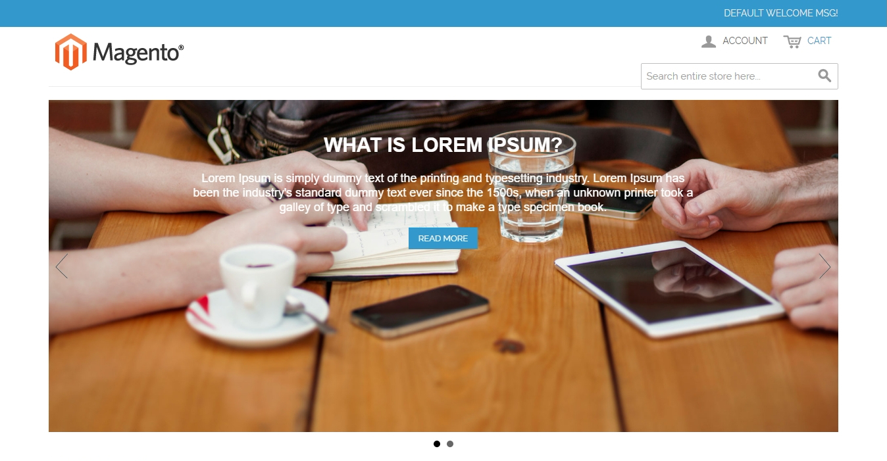
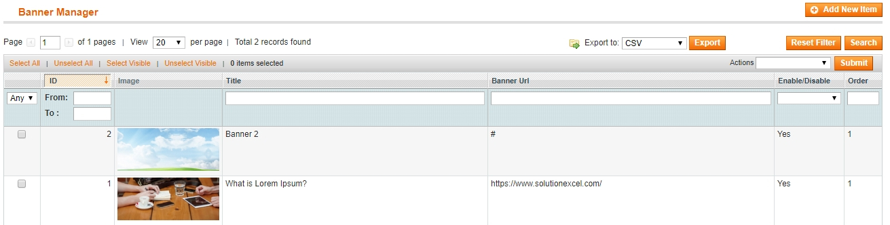
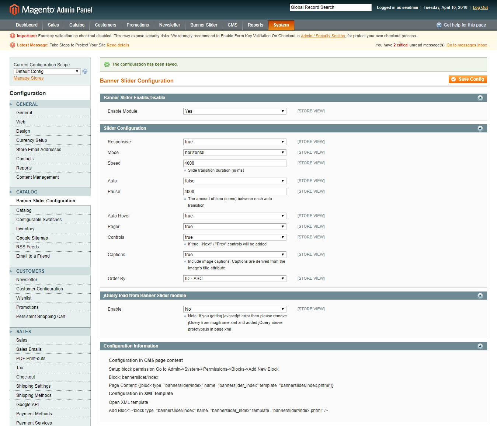

# Magento banner slider extension
Magento banner slider extension with bxslider. 

#### Compatible With:
Magento ver 1.9.3.8

### Available Features:
* Fully Responsive.
* Enable/Disable extension is easy via slider configuration.
* Easy to call Banner Slider to specific XML block OR in CMS page.
* Add unlimited banners.
* Able to add Title, Description, Button with custom url.
* Banner slider size auto manage according to banner outer container. 
* Add/Delete/Edit Functionality available on admin side.
* Manage Each banner order via admin.
* Fully open source so developer can modyfied everything frontend and backend fumctionality.

### Use this Code in Static Block or CMS page :-
 * Setup block permission Go to Admin => System => Permissions => Blocks => Add New Block (Block: bannerslider/index)
 * In Page Content:- {{block type="bannerslider/index" name="bannerslider" template="bannerslider/index.phtml"}}
 * In Layout XML:- &lt;block type="bannerslider/index" name="bannerslider" template="bannerslider/index.phtml" /&gt;
 * In phtml Template:- &lt;?php echo $this->getLayout()->createBlock('bannerslider/index')->setTemplate('bannerslider/index.phtml')->toHtml(); ?&gt;
 
 #### Screenshot

If you have any inquiry please contact with me via email or skype.
* Email: [info@solutionexcel.com](mailto:info@solutionexcel.com)
* Skype: solutionexcel
* Web: [Solution Excel](https://www.solutionexcel.com/)
